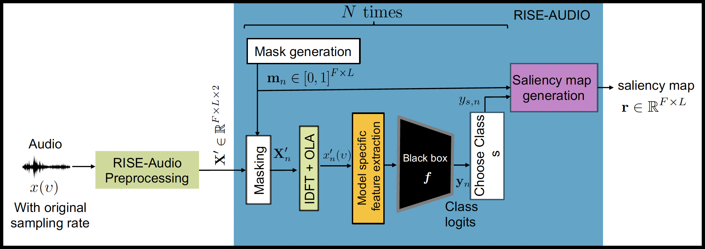

# Realization of a Model-Agnostic Explainable AI Method for Audio Classification

## Overview

This repository introduces a novel, model-agnostic Explainable AI (XAI) framework tailored specifically for audio classification tasks. It features three specialized architectures: RISE-SPEC, RISE-WAVE, and RISE-AUDIO which consistently outperform traditional baseline XAI methods, including RISE, LIME, and Grad-CAM.

  

## XAI Evaluation on ESC-50

### Spectrogram-based Models (2D)

| Method | | ResNet50 | | | HTS-AT | |
|---|---|---|---|---|---|---|
| | Ins(%)↑ | Del(%)↓ | OA(%)↑ | Ins(%)↑ | Del(%)↓ | OA(%)↑ |
| LIME | 78.90 | 29.50 | 49.40 | 63.28 | 26.45 | 36.83 |
| Grad-CAM | 76.25 | 30.69 | 45.56 | -- | -- | -- |
| RISE (Original) | 80.63 | 31.13 | 49.50 | 56.61 | 24.05 | 32.56 |
| **RISE-SPEC** | **82.02** | 22.26 | **59.76** | 57.26 | **19.91** | 37.35 |
| **RISE-AUDIO** | 75.88 | **20.58** | 55.30 | **74.29** | 36.72 | **37.57** |

### Waveform-based Models (1D)

| Method | | ACDNet | | | Wav2Vec2 | |
|---|---|---|---|---|---|---|
| | Ins(%)↑ | Del(%)↓ | OA(%)↑ | Ins(%)↑ | Del(%)↓ | OA(%)↑ |
| LIME | 47.31 | 15.67 | 31.64 | 71.34 | **24.62** | 46.72 |
| RISE (Original) | 51.80 | 27.91 | 23.89 | 70.35 | 33.53 | 36.82 |
| **RISE-WAVE** | 60.03 | 32.28 | 27.75 | 78.54 | 40.45 | 38.09 |
| **RISE-AUDIO** | **77.39** | **6.99** | **70.40** | **92.53** | 24.96 | **67.57** |